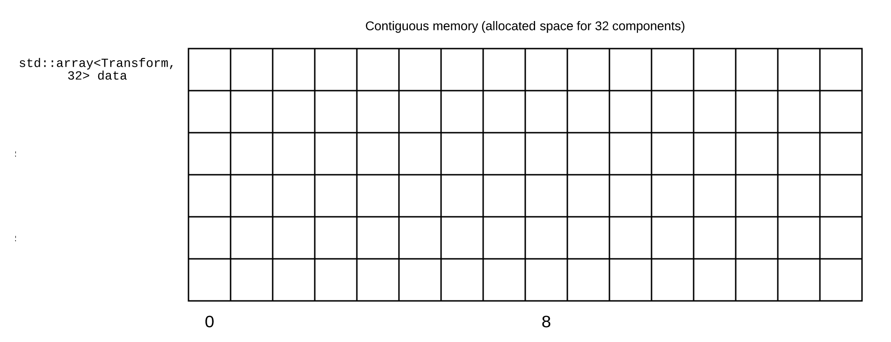
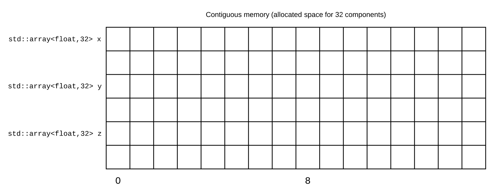
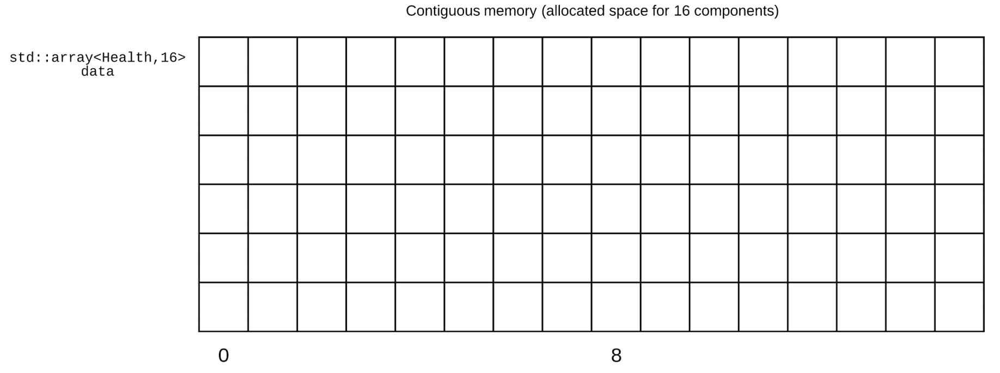
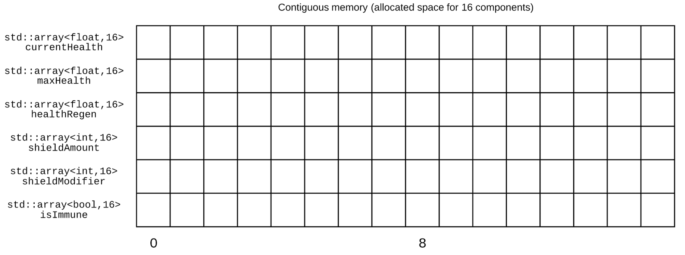

# ECS概述

Entity：类似于OOP中的class，是用来描述世界上的一个物体的符号（ID），可以认为是一系列Component的组合。

Component：是一组数据的集合，只存储数据而不包含任何逻辑行为。

System：是一系列行为的集合，只包含逻辑，可以针对同一类型的所有Entity实例进行逻辑处理。

# 框架图


# ECS的Cache优势

## 概念

AOS：Array of Structs 一个存放了结构体的数组

SOA：Struct Of Array 一个存放了数组的结构体

```cpp
//Array of structs
struct Transform {
 int x;
 float y;
 double z;
}
std::array<Transform, 1024> aos;

//Struct of arrays
struct soa {
 std::array<int, 1024> x;
 std::array<float, 1024> y;
 std::array<double, 1024> z;
}
```

当一组数据经常被同时访问时，把他们放进一个结构（AOS）是妥当的，也就是第一种transform的情况。

但当这组数据大多情况下被单独访问时，使用SOA更好。

例如：

```cpp
//这种情况下用SOA更好
struct Health {
  float currentHealth;
  float maxHealth;
  float healthRegen;
  int shieldAmount;
  int shieldModifier;
  bool isImmune;
}
```

## 缓存读取演示

### 情况一

AOS（经常同时访问）



SOA（经常同时访问）



二者相差不大，缓存都被充分利用了。

### 情况二

AOS（经常单独访问）



SOA（经常单独访问）



在AOS的情况下，由于我们只访问了组件上的两个变量，但其余的变量也会被拉入缓存中。这样就造成了缓存的使用效率低下。

而SOA 版本仍然具有出色的缓存性能，因为缓存仅拉入所需的数组即可，全是有效数据，命中率更高。

# Reference

https://medium.com/@savas/nomad-game-engine-part-4-3-aos-vs-soa-storage-5bec879aa38c